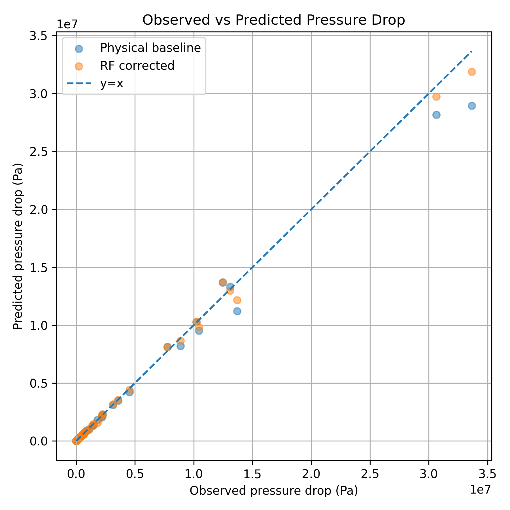
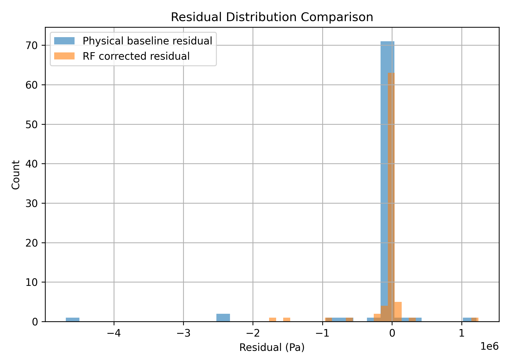
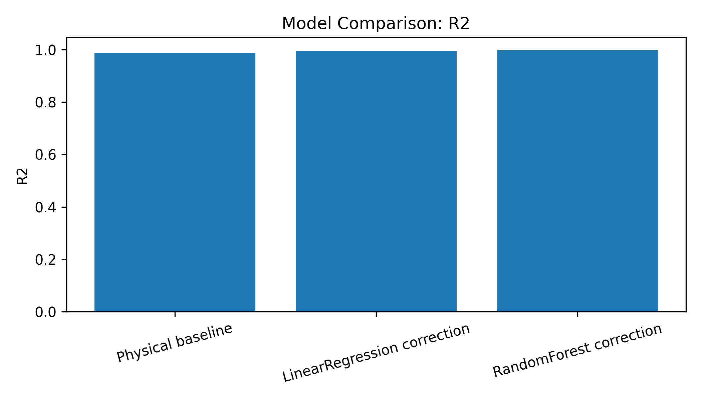
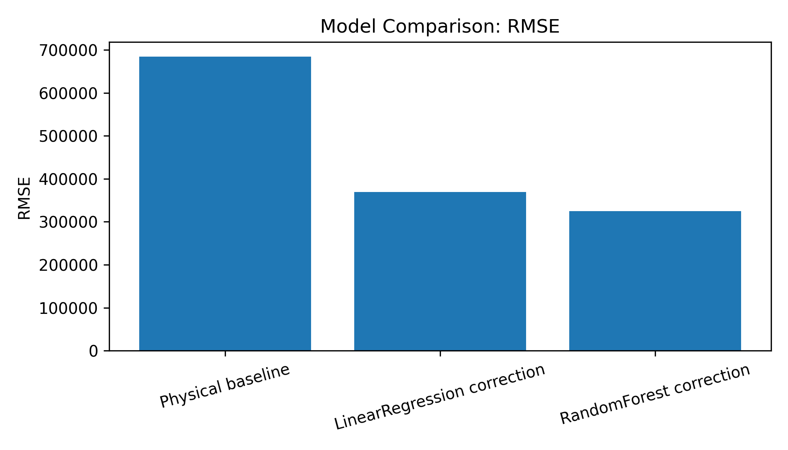
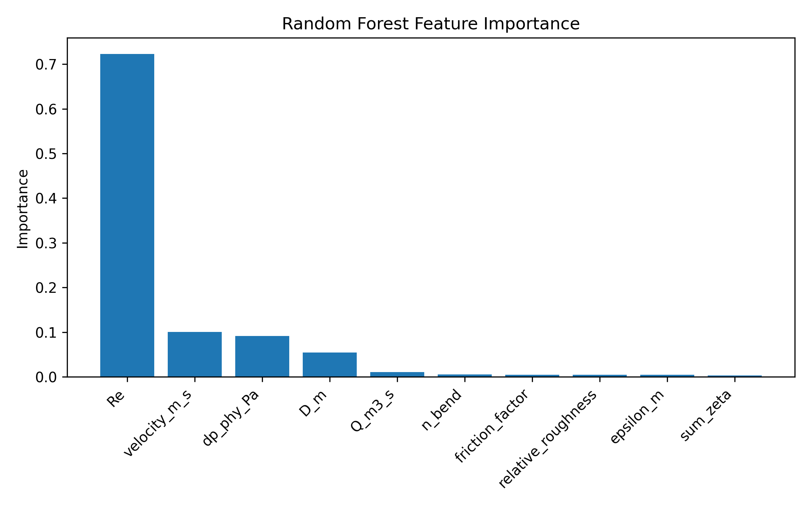

# Physics-Informed Residual Learning for Thermo-Fluid Pipeline Digital Twin

This repository presents a simplified research-oriented prototype for thermo-fluid pipeline digital twin modelling.

The framework combines:

- mechanistic thermo-fluid modelling,
- synthetic observation generation,
- residual learning correction (Linear Regression / Random Forest),
- vibration proxy modelling,
- and result visualization.

The goal is to demonstrate a physics-informed machine learning workflow for engineering systems.

> Note  
> Current experiments are based on pseudo-observed synthetic data for methodology demonstration only.  
> This repository is intended as a research prototype rather than an industrial deployment.

---

# Scientific Motivation

Traditional thermo-fluid pipeline simulators are often constructed from simplified physical assumptions and empirical correlations.

Although mechanistic models provide strong physical interpretability, they may exhibit systematic prediction discrepancies under uncertain operating conditions due to:

- parameter uncertainty,
- unmodelled thermal losses,
- measurement noise,
- and simplified flow assumptions.

This repository explores whether machine-learning-based residual correction can compensate for structured model errors while preserving the physical consistency of mechanistic modelling.

The work focuses on a hybrid modelling strategy combining:

- physics-based thermo-fluid simulation,
- synthetic discrepancy generation,
- interpretable residual learning,
- and lightweight digital twin visualization.

---

# Methodology

The workflow consists of four major stages:

1. Mechanistic thermo-fluid pipeline simulation  
2. Synthetic observation generation with structured discrepancies  
3. Residual learning using LR / RF models  
4. Evaluation and visualization of corrected predictions  

The mechanistic baseline is based on simplified thermo-fluid coupling and Darcy–Weisbach pressure-drop relations, while machine learning models are used to learn systematic residual patterns.

The residual-learning framework can be represented as:

\[
y_{corrected}=y_{physics}+\hat r(x)
\]

where:

- \(y_{physics}\) denotes mechanistic model prediction,
- \(\hat r(x)\) denotes learned residual correction.

The framework therefore preserves physical interpretability while improving predictive accuracy.

---

# Contributions

This repository demonstrates:

1. A simplified physics-informed residual-learning framework for thermo-fluid pipeline systems;  
2. A synthetic discrepancy generation strategy for studying model-bias correction;  
3. An interpretable hybrid modelling workflow combining mechanistic simulation and machine learning;  
4. A lightweight digital twin prototype integrating thermo-fluid prediction and vibration proxy monitoring.  

---

# Project Structure

```text
pipe_research/
├── physical_model.py
├── synthetic_data.py
├── ml_model.py
├── vibration_model.py
├── plotting.py
└── evaluation.py

outputs/
├── model_metrics.csv
├── result_summary.md
├── true_vs_pred.png
├── residual_histogram.png
├── metrics_bar_R2.png
├── metrics_bar_RMSE.png
└── feature_importance.png

run_all.py
streamlit_app.py
requirements.txt
README.md
```

---

# Installation

```bash
pip install -r requirements.txt
```

---

# Run Experiments

```bash
python run_all.py
```

After execution, all evaluation figures and metrics will be automatically generated under:

```text
outputs/
```

---

# Results

## Prediction Comparison



The hybrid residual-learning framework improves agreement between predictions and pseudo-observed targets compared with the mechanistic baseline.

---

## Residual Distribution



Residual-learning correction reduces systematic prediction bias and narrows the residual distribution.

---

## R² Comparison



Residual-learning models improve the coefficient of determination (R²) relative to the baseline mechanistic model.

---

## RMSE Comparison



The hybrid framework reduces RMSE compared with the physics-only baseline.

---

# Experimental Observation

Under the default benchmark setting, Random Forest residual learning improves predictive performance on the held-out test set.

Typical observations include:

* reduced RMSE,
* improved R²,
* narrower residual distributions,
* and enhanced prediction consistency.

Exact numerical results may vary depending on the random seed and synthetic discrepancy configuration.

---

# Feature Importance

The Random Forest residual model provides interpretable feature importance estimation.

Example output:



This helps identify which operating variables contribute most strongly to systematic model discrepancies.

---

# Vibration Proxy Modelling

The repository also contains a simplified SDOF-based vibration proxy model for demonstrating coupled monitoring behavior.

Example visualizations include:

* vibration vs flow rate
* vibration vs pressure fluctuation

These modules are intended as lightweight demonstrations rather than full transient structural simulations.


---

# Potential Future Extensions

* validation using real industrial operating data,
* stronger physical consistency constraints,
* transient multi-physics coupling,
* uncertainty-aware residual correction,
* and deployment-oriented online updating strategies.
---

# Disclaimer

This repository is intended for:

* research demonstration,
* academic portfolio presentation,
* methodology illustration,
* and engineering-oriented machine learning experimentation.

It should not be interpreted as a validated industrial digital twin system.

---
# Author

**Mingzhuo Lv**  
Oil & Gas Storage and Transportation Engineering  
China University of Petroleum (Beijing)

## Research Interests

- thermo-fluid modelling
- physics-informed machine learning
- hybrid modelling
- digital twin systems
- engineering AI applications
